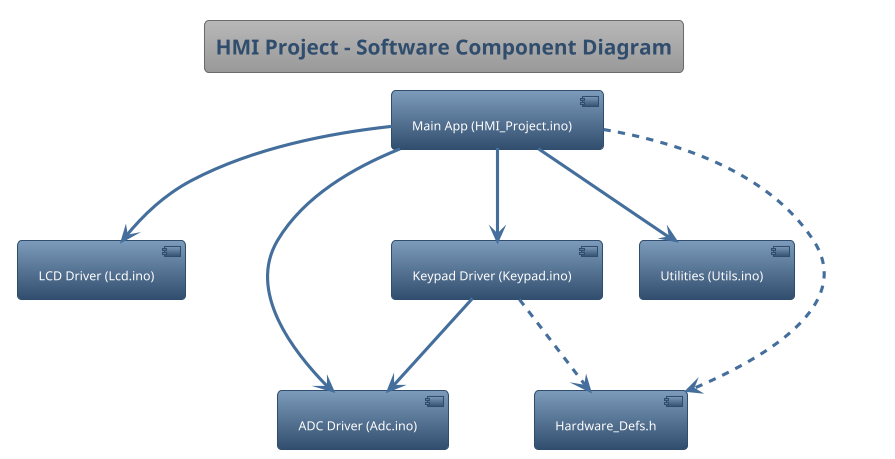
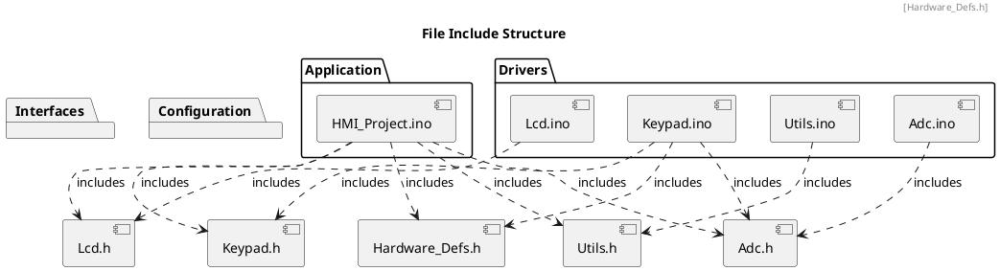

# Detailed Design Document

| **Author**              | `Ali Akram - Mahmoud Adgham - Ziad Khalil`                                       |
|:------------------------|:-----------------------------------------------------|
| **Status**              | `Draft`                          |
| **Version**             | `1.0`                                                |
| **Date**                | `13/11/2025`                                         |

## Introduction

This document provides the detailed software design for the "Human Machine Interface" project, which is Element 2 of the KH5023FTE Embedded System Design & Development module coursework. The system is developed for the AVR ATmega328P microcontroller.

### Purpose

This project aims to build a reliable electronic system that uses the UART communication link to send and receive data between its main chip (the microcontroller) and an outside device like a computer. The system has three main goals:

Read and Show Data: The system will constantly take an analog reading (like voltage) using the ADC and show the result on the LCD screen.

Allow User Control: The system will watch the KeyPad for button presses, specifically to let the user press a button to send the current reading to the computer.

Send Data Out: The system will use UART to dependably send the prepared data to the computer when the user triggers it.

### Scope

According to the project brief and the architectural requirements, this detailed design's scope is limited to two primary use cases that cover data acquisition and user interaction:

Use Case #1: Display and Monitoring
The system will continuously acquire and process analog data using the ADC module. It will take the digitized value, format it (e.g., convert to temperature or LDR intensity), and immediately display the result on the LCD 16x2 screen for real-time monitoring by the user. An LED or Buzzer alert will be triggered if the monitored value falls outside the configured High or Low limits.

Use Case #2: User Configuration and Transmission
The system will monitor the KeyPad for user input. It must allow the user to configure the High Limit (LH) and the Low Limit (LL) for the monitored sensor data using dedicated control buttons. Furthermore, upon a specific key press (e.g., an 'Enter' key), the system must transmit the current sensor reading to the external host via the UART interface.

Native C programming must be used to complete the project; no external libraries or Arduino-based code may be used. 

## Architectural Overview

This section describes where this module resides in the context of the software architecture

### Assumptions & Constraints
Hardware: The target microcontroller is an AVR ATmega328P operating at a clock speed of 16 MHz.

Programming Language: The project must be implemented strictly in Native C.

Dependencies: No external libraries or Arduino-specific functions are permitted.

Development Tools: Code must be managed in a Git repository, and this design document must use PlantUML for diagrams.

## Functional Description
The system runs on one continuous, loop that manages all its core activities. This loop has three primary jobs:

1. Check Sensor & Update Screen: The system constantly reads the sensor data using the ADC. It quickly shows this new value on the LCD screen.

2. Look for Button Presses: It continually checks the KeyPad to see if the user pressed a button, especially the buttons used to set the High and Low limits for the sensor.

3. Send Data if Triggered: If the user presses the special send button on the KeyPad, the system uses UART to immediately send the current sensor reading to the computer.
## Implementation of the Module
This chapter discusses the detailed design of the module.

## Integration and Configuration
### Static Files
All source and header files that comprise the project are listed below.
| File name | Contents |
| :--- | :--- |
| **HMI\_Project.ino** | Main application logic (`setup()` / `loop()`), input processing, and display control. |
| **Hardware\_Defs.h** | Central definitions for all hardware pins, ports, and ADC thresholds. |
| **Adc.h** | Exported interface for the ADC driver. |
| **Adc.ino** | Implementation of the ADC driver (init and read functions). |
| **Lcd.h** | Exported interface for the 16x2 LCD driver. |
| **Lcd.ino** | Implementation of the 4-bit LCD driver. |
| **Keypad.h** | Exported interface for the analog keypad driver. |
| **Keypad.ino** | Implementation of the keypad driver (maps ADC values to key presses). |
| **Utils.h** | Exported interface for utility functions. |
| **Utils.ino** | Implementation of `Simple_Itoa` utility function. |

### Include Structure

If there is a complex file structure e.g. more than one c-file or more than two h-files use a diagram to explain the relationship between the source and dependent include files.

### Configuration
All hardware and application-level constants are defined in Hardware_Defs.h for easy configuration.| Name | Value range | Description |
| Name | Value | Description |
|:---|:---|:---|
| *LCD Pins* | | |
| LCD_RS_PORT | PORTB | Port for LCD Register Select |
| LCD_RS_PIN | 0 (PB0) | Pin for LCD Register Select |
| LCD_E_PORT | PORTB | Port for LCD Enable |
| LCD_E_PIN | 1 (PB1) | Pin for LCD Enable |
| LCD_DATA_PORT| PORTD | Port for LCD Data Lines (D4-D7) |
| LCD_D4_PIN | 4 (PD4) | Data Line 4 |
| LCD_D5_PIN | 5 (PD5) | Data Line 5 |
| LCD_D6_PIN | 6 (PD6) | Data Line 6 |
| LCD_D7_PIN | 7 (PD7) | Data Line 7 |
| *LED Pin* | | |
| LED_PORT | PORTD | Port for the Alarm LED |
| LED_PIN | 3 (PD3) | Pin for the Alarm LED |
| *ADC Channels* | | |
| KEYPAD_ADC_CHANNEL | 0 | ADC channel for the analog keypad |
| POT_ADC_CHANNEL | 2 | ADC channel for the potentiometer |
| *Keypad Thresholds*| | ADC values for key detection |
| KEY_ADC_RIGHT | 50 | Threshold for RIGHT key (0-49) |
| KEY_ADC_UP | 195 | Threshold for UP key (50-194) |
| KEY_ADC_DOWN | 380 | Threshold for DOWN key (195-379) |
| KEY_ADC_LEFT | 555 | Threshold for LEFT key (380-554) |
| KEY_ADC_SELECT| 790 | Threshold for SELECT key (555-789) |
