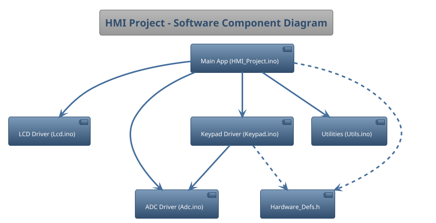
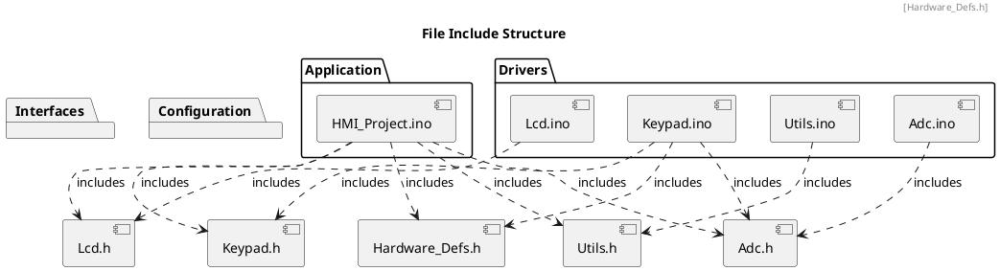

# Detailed Design Document

| **Author**              | `Ali Akram - Mahmoud Adgham - Ziad Khalil`                                       |
|:------------------------|:-----------------------------------------------------|
| **Status**              | `Draft`                          |
| **Version**             | `1.0`                                                |
| **Date**                | `13/11/2025`                                         |

## Introduction

This document provides the detailed software design for the "Human Machine Interface" project, which is Element 2 of the KH5023FTE Embedded System Design & Development module coursework. The system is developed for the AVR ATmega328P microcontroller.

### Purpose

This project aims to build a reliable electronic system that uses the UART communication link to send and receive data between its main chip (the microcontroller) and an outside device like a computer. The system has three main goals:

Read and Show Data: The system will constantly take an analog reading (like voltage) using the ADC and show the result on the LCD screen.

Allow User Control: The system will watch the KeyPad for button presses, specifically to let the user press a button to send the current reading to the computer.

Send Data Out: The system will use UART to dependably send the prepared data to the computer when the user triggers it.

### Scope

## Architectural Overview

This section describes where this module resides in the context of the software architecture

### Assumptions & Constraints
Indicate constraints of the low level design and any assumptions appropriate for the design.

## Functional Description
The following chapter describes the software functionality.  The following is a list of suggested sections to be considered for inclusion.

## Implementation of the Module
This chapter discusses the detailed design of the module.

## Integration and Configuration
### Static Files
Typically a module consists of C and H files but other file types may exist. List all files that form this module

| File name | Contents                             |
|-----------|--------------------------------------|
| abc_xxx.c | Source code file, add detail         |
| abc.h     | Export Interface file                |
| abci.h    | Import and Module Configuration file |

### Include Structure

If there is a complex file structure e.g. more than one c-file or more than two h-files use a diagram to explain the relationship between the source and dependent include files.

### Configuration
Any required hardware/software or system configuration that can be adjusted a header file shall be detailed in this section. This can be placed in the table below.
| Name | Value range | Description |
|------|-------------|-------------|
|      |             |             |
